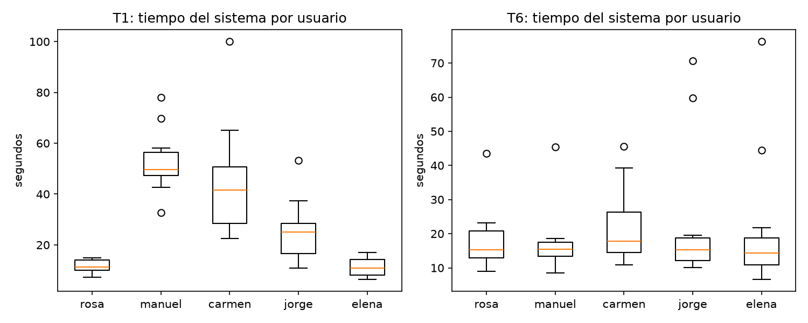
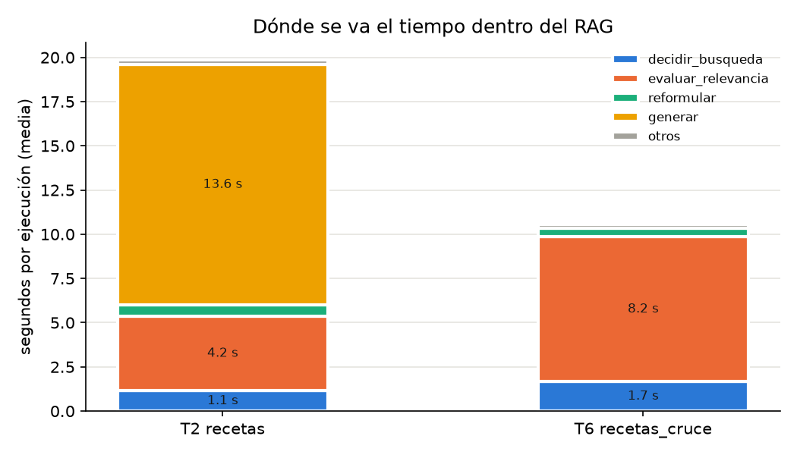

# Campaña `campana_2026-10-02`

- Ejecuciones: **360** de 360 planificadas; 7 con timeout o error (excluidas de tiempos y tokens, cuentan como fallo).
- Commit: `73031da` (cambios sin commit: True).
- Modelos: ['zai-org/GLM-5.3-Flash'].
- `system_fingerprint` vistos: ['vllm-0.30.1rc1.dev193+gddd6fbca1-tp4-ep-4db57b97'].
- T3 decididas por la red de emergencia (sin LLM): 15/60.
- Valores: media ± DE muestral. Los tokens de razonamiento son PARTE de los de salida.

## 1. Tokens y tiempo por agente

| Tarea | Agente | n | Tiempo (s) | Llamadas LLM | Tokens entrada | Tokens salida | de ellos, razonamiento |
|---|---|---|---|---|---|---|---|
| T1 medicación | orchestrator | 58 | 2.34 ± 3.27 | 1.0 ± 0.0 | 160 ± 4 | 334 ± 48 | 278 ± 45 |
| T1 medicación | medicacion | 58 | 25.88 ± 19.35 | 1.0 ± 0.0 | 826 ± 261 | 4118 ± 2935 | 3605 ± 2756 |
| T2 recetas | orchestrator | 58 | 3.32 ± 5.06 | 1.0 ± 0.0 | 152 ± 5 | 359 ± 71 | 298 ± 66 |
| T2 recetas | recetas | 58 | 19.86 ± 17.12 | 5.8 ± 1.3 | 1441 ± 302 | 2936 ± 1855 | 2325 ± 1683 |
| T3 emergencia | orchestrator | 59 | 2.93 ± 4.92 | 0.7 ± 0.4 | 117 ± 69 | 371 ± 314 | 331 ± 294 |
| T3 emergencia | medicacion | 6 | 38.66 ± 19.68 | 1.0 ± 0.0 | 826 ± 274 | 5591 ± 3599 | 5018 ± 3390 |
| T3 emergencia | emergencia | 53 | 0.00 ± 0.00 | 0.0 ± 0.0 | 0 ± 0 | 0 ± 0 | 0 ± 0 |
| T4 familia | orchestrator | 59 | 1.47 ± 0.35 | 1.0 ± 0.0 | 158 ± 2 | 271 ± 58 | 222 ± 55 |
| T4 familia | medicacion | 14 | 33.06 ± 31.46 | 1.0 ± 0.0 | 807 ± 252 | 4134 ± 2483 | 3615 ± 2282 |
| T4 familia | familia | 45 | 0.00 ± 0.00 | 0.0 ± 0.0 | 0 ± 0 | 0 ± 0 | 0 ± 0 |
| T5 small talk | orchestrator | 60 | 1.77 ± 0.53 | 1.0 ± 0.0 | 154 ± 1 | 291 ± 80 | 237 ± 78 |
| T5 small talk | small_talk | 60 | 0.00 ± 0.00 | 0.0 ± 0.0 | 0 ± 0 | 0 ± 0 | 0 ± 0 |
| T6 medicamento × comida | orchestrator | 59 | 2.73 ± 3.55 | 1.0 ± 0.0 | 166 ± 2 | 392 ± 58 | 327 ± 59 |
| T6 medicamento × comida | medicacion_cruce | 59 | 0.00 ± 0.00 | 0.0 ± 0.0 | 0 ± 0 | 0 ± 0 | 0 ± 0 |
| T6 medicamento × comida | recetas_cruce | 59 | 10.58 ± 10.79 | 5.0 ± 1.8 | 1302 ± 517 | 1358 ± 896 | 1084 ± 861 |
| T6 medicamento × comida | integrador | 59 | 7.12 ± 7.57 | 1.0 ± 0.0 | 366 ± 146 | 955 ± 408 | 819 ± 413 |

## 2. Tokens y tiempo del sistema

| Tarea | n | Tiempo (s) | Mediana | P95 | Llamadas LLM | Tokens entrada | Tokens salida | Razonamiento | % razonamiento |
|---|---|---|---|---|---|---|---|---|---|
| T1 medicación | 58 | 28.24 ± 20.75 | 23.07 | 70.16 | 2.0 ± 0.0 | 986 ± 261 | 4453 ± 2929 | 3883 ± 2750 | 87% |
| T2 recetas | 58 | 23.19 ± 18.50 | 18.33 | 55.20 | 6.8 ± 1.3 | 1594 ± 299 | 3295 ± 1851 | 2623 ± 1681 | 80% |
| T3 emergencia | 59 | 6.87 ± 14.68 | 1.45 | 49.20 | 0.8 ± 0.6 | 201 ± 285 | 940 ± 2157 | 841 ± 1969 | 90% |
| T4 familia | 59 | 9.33 ± 20.63 | 1.53 | 49.90 | 1.2 ± 0.4 | 349 ± 367 | 1252 ± 2145 | 1080 ± 1907 | 86% |
| T5 small talk | 60 | 1.78 ± 0.53 | 1.60 | 2.82 | 1.0 ± 0.0 | 154 ± 1 | 291 ± 80 | 237 ± 78 | 81% |
| T6 medicamento × comida | 59 | 20.44 ± 14.72 | 15.38 | 59.78 | 7.0 ± 1.8 | 1834 ± 641 | 2705 ± 951 | 2230 ± 918 | 82% |
| Todas | 353 | 14.87 ± 18.91 | 9.79 | 51.18 | 3.1 ± 2.8 | 848 ± 762 | 2141 ± 2394 | 1803 ± 2139 | 84% |

## 3. ¿Cambia con el usuario? Tiempo del sistema (s) por usuario

| Tarea | rosa | manuel | carmen | jorge | elena | Kruskal-Wallis tiempo | Kruskal-Wallis tokens salida |
|---|---|---|---|---|---|---|---|
| T1 | 11.6 ± 2.5 | 52.7 ± 13.1 | 44.5 ± 21.8 | 25.3 ± 11.9 | 11.2 ± 3.7 | H = 42.34, p = 0.000 | H = 46.42, p = 0.000 |
| T2 | 19.7 ± 11.0 | 20.1 ± 14.5 | 19.4 ± 12.4 | 33.9 ± 32.9 | 23.5 ± 13.1 | H = 2.49, p = 0.646 | H = 0.94, p = 0.918 |
| T3 | 8.7 ± 13.0 | 9.1 ± 20.2 | 7.2 ± 18.5 | 6.0 ± 13.8 | 3.6 ± 6.7 | H = 0.50, p = 0.973 | H = 0.61, p = 0.962 |
| T4 | 6.0 ± 8.3 | 14.9 ± 32.4 | 10.2 ± 15.9 | 12.5 ± 29.4 | 3.6 ± 4.0 | H = 2.00, p = 0.736 | H = 1.18, p = 0.881 |
| T5 | 1.7 ± 0.4 | 1.7 ± 0.5 | 1.7 ± 0.5 | 1.7 ± 0.4 | 2.1 ± 0.7 | H = 4.61, p = 0.330 | H = 1.23, p = 0.873 |
| T6 | 18.0 ± 9.2 | 17.5 ± 9.8 | 22.4 ± 11.9 | 22.8 ± 20.2 | 21.3 ± 19.9 | H = 1.97, p = 0.742 | H = 1.53, p = 0.821 |

## 4. Tasa de éxito

| Tarea | Éxitos | % | IC 95% (Wilson) | Timeouts | Errores | Chequeos que fallaron (sin cortes) |
|---|---|---|---|---|---|---|
| T1 medicación | 58/60 | 96.7% | 88.6–99.1% | 2 | 0 | — |
| T2 recetas | 58/60 | 96.7% | 88.6–99.1% | 2 | 0 | — |
| T3 emergencia | 53/60 | 88.3% | 77.8–94.2% | 1 | 0 | intencion 6, camino 6 |
| T4 familia | 45/60 | 75.0% | 62.8–84.2% | 1 | 0 | intencion 14, camino 14 |
| T5 small talk | 60/60 | 100.0% | 94.0–100.0% | 0 | 0 | — |
| T6 medicamento × comida | 59/60 | 98.3% | 91.1–99.7% | 1 | 0 | — |
| Todas | 333/360 | 92.5% | 89.3–94.8% | 7 | 0 | intencion 20, camino 20 |

### Ejecuciones cortadas

| Ejecución | Motivo | Agente más lento que terminó | Segundos | Tokens salida (razonamiento) | Sin respuesta |
|---|---|---|---|---|---|
| T1-t1_f1-manuel-r1 | timeout | medicacion | 195 | 20396 (19452) | — |
| T1-t1_f2-manuel-r1 | timeout | medicacion | 156 | 9258 (8165) | — |
| T4-t4_f1-manuel-r2 | timeout | medicacion | 154 | 13558 (12545) | — |
| T2-t2_f2-manuel-r2 | timeout | recetas | 105 | 2974 (2335) | — |
| T2-t2_f2-jorge-r3 | timeout | orchestrator | 2 | 437 (359) | recetas/evaluar_relevancia |
| T3-t3_f4-manuel-r3 | timeout | orchestrator | 5 | 691 (641) | medicacion/medicacion |
| T6-t6_f1-manuel-r3 | timeout | orchestrator | 3 | 389 (322) | recetas_cruce/evaluar_relevancia |

## 5. Caminos en T6

Camino correcto (orchestrator → {medicacion_cruce, recetas_cruce} → integrador): **59/60** (98.3%, IC 95% 91.1–99.7%).

| Camino recorrido | Veces |
|---|---|
| orchestrator → medicacion_cruce → recetas_cruce → integrador | 59 |
| (sin camino: timeout o error) | 1 |

Con camino correcto, qué más falló:

| Chequeo | Fallos |
|---|---|
| fuente | 0 |
| interacciones | 0 |
| sin_error | 0 |

## 6. Desglose del tiempo dentro del RAG

| Tarea | Agente | Subnodo | Veces por ejecución | Tiempo por vez (s) | % del tiempo del agente |
|---|---|---|---|---|---|
| T2 | recetas | generar | 0.74 | 18.35 ± 17.68 | 68% |
| T2 | recetas | evaluar_relevancia | 1.26 | 3.36 ± 3.46 | 21% |
| T2 | recetas | decidir_busqueda | 1.00 | 1.14 ± 1.61 | 6% |
| T2 | recetas | reformular | 0.26 | 2.42 ± 0.67 | 3% |
| T2 | recetas | recuperar | 1.26 | 0.19 ± 0.30 | 1% |
| T2 | recetas | expandir_contexto | 0.74 | 0.01 ± 0.00 | 0% |
| T2 | recetas | sin_resultado | 0.26 | 0.00 ± 0.00 | 0% |
| T6 | recetas_cruce | evaluar_relevancia | 1.25 | 6.52 ± 9.23 | 77% |
| T6 | recetas_cruce | decidir_busqueda | 1.00 | 1.67 ± 3.47 | 16% |
| T6 | recetas_cruce | reformular | 0.25 | 1.92 ± 0.59 | 5% |
| T6 | recetas_cruce | recuperar | 1.25 | 0.17 ± 0.21 | 2% |
| T6 | recetas_cruce | expandir_contexto | 1.00 | 0.01 ± 0.00 | 0% |

## Figuras

